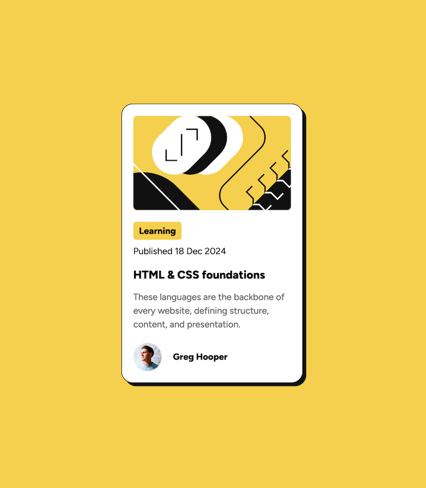

# Frontend Mentor - Blog Preview Card solution

This is a solution to the Frontend Mentor Challenge [Blog Preview Card](https://www.frontendmentor.io/challenges/blog-preview-card-ckPaj01IcS).

## Table of contents

- [Overview](#overview)
  - [Screenshot](#screenshot)
  - [Links](#links)
- [My process](#my-process)
  - [Built with](#built-with)
  - [What I learned](#what-i-learned)
- [Author](#author)

## Overview

### Screenshot

### Links

- Repo URL: [Code Repo](https://github.com/nishantm96/nishantm96.github.io/tree/main/blog-preview-card)
- Live Site URL: [Live Solution](https://nishantm96.github.io/blog-preview-card)

## My process

### Built with

- CSS custom properties
- Flexbox
- CSS Grid

### What I learned

I learned the basics of setting up of HTML layout and CSS Flexbox and Grid. 
I also learned how to import fonts using files in CSS.
