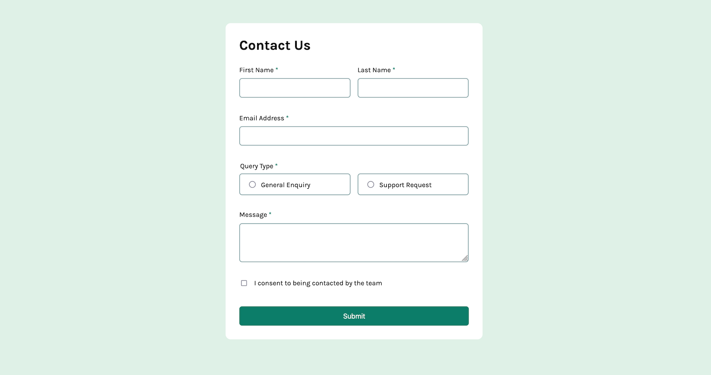

# Frontend Mentor - Blog Preview Card solution

This is a solution to the Frontend Mentor Challenge [Contact Form](https://www.frontendmentor.io/challenges/contact-form--G-hYlqKJj).

## Table of contents

- [Overview](#overview)
  - [Screenshot](#screenshot)
  - [Links](#links)
- [My process](#my-process)
  - [Built with](#built-with)
  - [What I learned](#what-i-learned)

## Overview

### Screenshot

### Links

- Repo URL: [Code Repo](https://github.com/nishantm96/nishantm96.github.io/tree/main/contact-form)
- Live Site URL: [Live Solution](https://nishantm96.github.io/contact-form)

## My process

### Built with

- CSS Flexbox
- HTML Form
- Javascript Form Validation

### What I learned

- I learned the basics of setting up of HTML layout and CSS Flexbox.
- I learned about accent-color CSS properties (not all browsers support it). It can change color for checkbox and radio input selector.