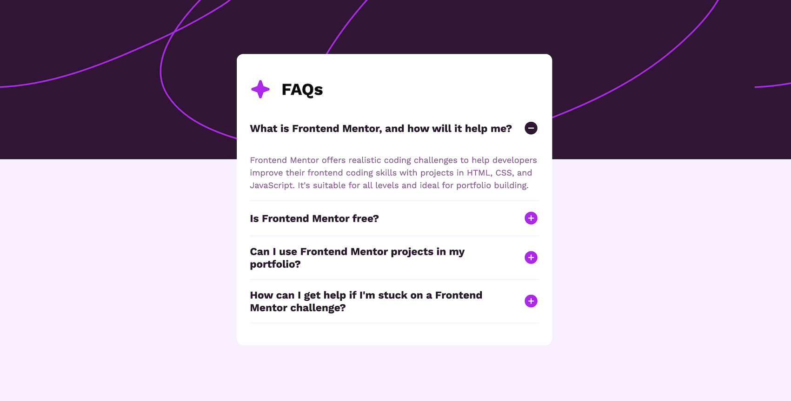

# Frontend Mentor - Blog Preview Card solution

This is a solution to the Frontend Mentor Challenge [FAQ Accordion](https://www.frontendmentor.io/challenges/faq-accordion-wyfFdeBwBz).

## Table of contents

- [Overview](#overview)
  - [Screenshot](#screenshot)
  - [Links](#links)
- [My process](#my-process)
  - [Built with](#built-with)
  - [What I learned](#what-i-learned)

## Overview

### Screenshot

### Links

- Repo URL: [Code Repo](https://github.com/nishantm96/nishantm96.github.io/tree/main/faq-accordion)
- Live Site URL: [Live Solution](https://nishantm96.github.io/faq-accordion)

## My process

### Built with

- CSS Grid for accordion transition
- CSS Media Query
- Javascript

### What I learned

- I learned about how to do accordion transition between open and close states using CSS grid (grid template rows property supports transition). I found this approach from [here](https://keithjgrant.com/posts/2023/04/transitioning-to-height-auto/).

- I learned about tabindex and making elements tabbable (not all elements are tabbable by default).