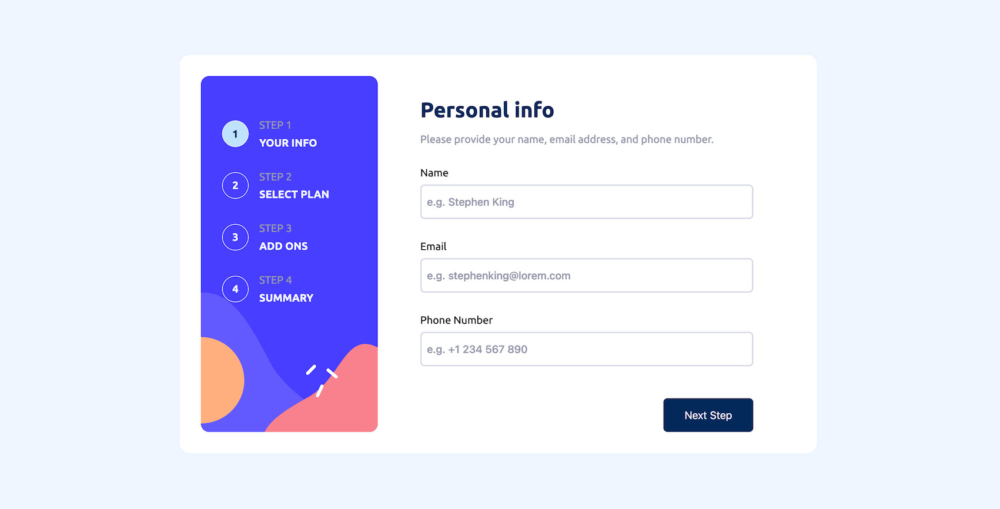

# Frontend Mentor - Blog Preview Card solution

This is a solution to the Frontend Mentor Challenge [Multi-step Form](https://www.frontendmentor.io/challenges/multistep-form-YVAnSdqQBJ).

## Table of contents

- [Overview](#overview)
  - [Screenshot](#screenshot)
  - [Links](#links)
- [My process](#my-process)
  - [Built with](#built-with)
  - [What I learned](#what-i-learned)

## Overview

### Screenshot

### Links

- Repo URL: [Code Repo](https://github.com/nishantm96/nishantm96.github.io/tree/main/multi-step-form)
- Live Site URL: [Live Solution](https://nishantm96.github.io/multi-step-form)

## My process

### Built with

- CSS Media Query
- CSS Position
- Javascript

### What I learned

- Position CSS properties apply based on containing block for target element. For position fixed, it is usually the viewport / body but can change based on certain attributes. Read more [here](https://developer.mozilla.org/en-US/docs/Web/CSS/Containing_block#identifying_the_containing_block)
- I learned about how to implement toggle switch from checkbox - [here](https://www.w3schools.com/howto/howto_css_switch.asp)
- In this project, implementing mobile design first was easier and then media query to replace design changes for desktop.