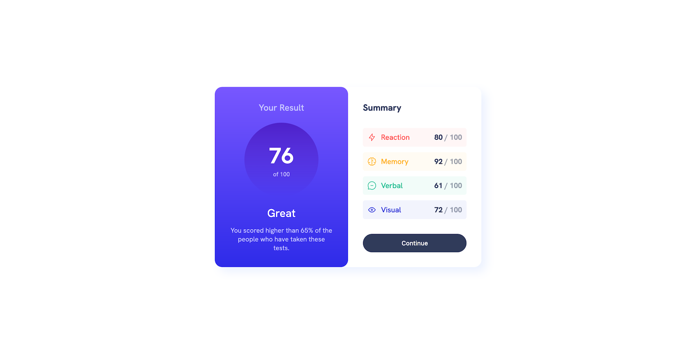

# Frontend Mentor - QR code component solution

This is a solution to the Frontend Mentor Challenge [QR Code Component](https://www.frontendmentor.io/challenges/results-summary-component-CE_K6s0maV).

## Table of contents

- [Overview](#overview)
  - [Screenshot](#screenshot)
  - [Links](#links)
- [My process](#my-process)
  - [Built with](#built-with)
  - [What I learned](#what-i-learned)

## Overview

### Screenshot

### Links

- Repo URL: [Code Repo](https://github.com/nishantm96/nishantm96.github.io/tree/main/results-summary-component)
- Live Site URL: [Live Solution](https://nishantm96.github.io/results-summary-component)

## My process

### Built with

- CSS Media Query
- CSS Flexbox
- Javascript - DOM and fetch

### What I learned

- I learned the basics of setting up of HTML layout using Javascript and CSS Flexbox. 

- I also learned basics of linear-gradient.
