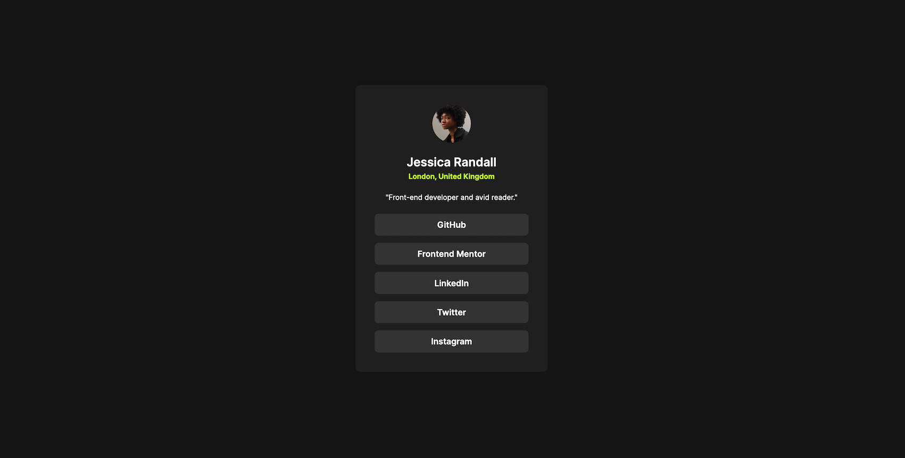

# Frontend Mentor - Blog Preview Card solution

This is a solution to the Frontend Mentor Challenge [Social Links Profile](https://www.frontendmentor.io/challenges/social-links-profile-UG32l9m6dQ).

## Table of contents

- [Overview](#overview)
  - [Screenshot](#screenshot)
  - [Links](#links)
- [My process](#my-process)
  - [Built with](#built-with)
  - [What I learned](#what-i-learned)

## Overview

### Screenshot

### Links

- Repo URL: [Code Repo](https://github.com/nishantm96/nishantm96.github.io/tree/main/social-links-profile)
- Live Site URL: [Live Solution](https://nishantm96.github.io/social-links-profile)

## My process

### Built with

- Flexbox

### What I learned

- I learned the basics of setting up of HTML layout and CSS Flexbox. 

- I learned how to create empty links and that links are tabbable elements (if they have href attribute).

